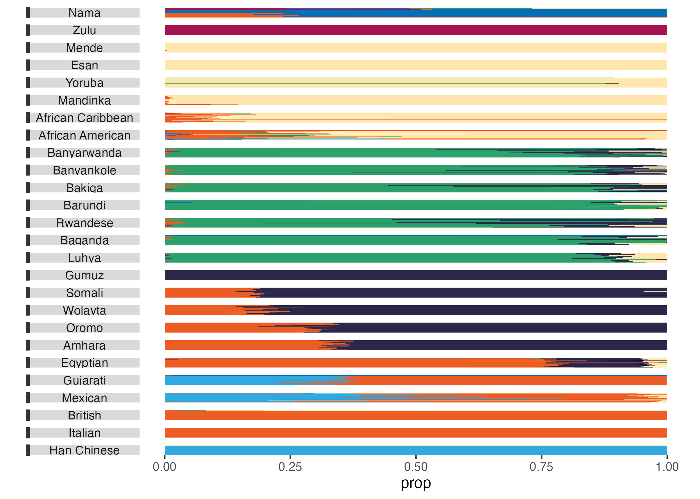

####  {.outline}

{.lightbox fig-alt="" width="800"}

#### 

:::: disclaimer_block
::: license_box_header
The contents of this case study are solely the responsibility of the authors and do not represent the official views of the Fred Hutch or NIH.
:::
::::

:::: license_block
::: license_box_header
License
:::

This work is published under CC By-NC, you can reuse it for free with attribution, but you can not use the materials for commercial purposes.
::::

::::: reference_box
::: reference_box_header
To cite this case study, please use:
:::

::: inner_block
Kate Isaac, Hanako Osuga, Jeanne Chowning, Wright, Carrie (2026). <https://github.com/opencasestudies/ocs-ripples-ancestry>. The Biology of Ancestry (Version v1.0.0).
:::
:::::

To access the GitHub repository to see the source materials and data that went into making the case study, please see here: <https://github.com/opencasestudies/ocs-ripples-ancestry>.

# **Motivation**

------------------------------------------------------------------------

This case study explores the topic of human , especially with respect to .

:::::::: definition_box
::::::: panel-tabset
### **Definition**: Genomic Variation

::: definition_box_header
Human Genomic Variation
:::

::: inner_block
Genomics variation refers to DNA sequence differences among individuals within a population or when comparing different populations. Human genomic variation focuses specifically on variation within the human species. Some variants influence biological function (potentially causing disease), while others have no biological effects [@GenomicVariationNIH].
:::

### **Definition**: Ancestry

::: definition_box_header
Ancestry
:::

::: inner_block
Ancestry is a personal understanding of one's genomic heritage - a statement about a person's relationship to other individuals in their genealogical history. Ancestry is often self-reported by an individual and is a personal concept focusing on the how or the process of their family history rather than a societal pattern [@Yudell2016].
:::
:::::::
::::::::

To explore these topics, we'll first ask questions such as "What is the human genome?", "What is genomic variation?", and "Why should we care about human genomic variation?". Data representing genomic variation and ancestry will be discussed and ways to represent or visualize this data will be highlighted. In addition, ways to work with data will be compared and contrasted, examining the pros and cons of techniques that either utilize more manual approaches or more  processing through computational work. Since the data we will be working with is not large, we can use these techniques in any case.

## What is the human genome?

The human  (all of an individual's ) is made of stretches of . The nucleotides ultimately encode for  products that function in the body in important ways. Proteins include enzymes like amylase to break down food, peptide hormones such as insulin to regulate blood sugar, and structural proteins such as keratin in skin and nails. An individual's genome encodes all the proteins they need for their body to function normally.

```{r, echo = FALSE, message=FALSE, warning=FALSE, out.width="100%"}
ottrpal::include_slide("https://docs.google.com/presentation/d/1fmPgoGk8KCZvRQx9ljjti8Nn44JdA2G2yGm1BwmL7V8/edit?slide=id.p#slide=id.p")
```

The Central Dogma is a theory describing how genetic information is stored and how it flows. DNA stores genetic information within the genome. DNA produces  through a process called . Specific regions of the genome called  are transcribed into RNA molecules. RNA produces proteins through a process called .

```{r, echo = FALSE, message= FALSE, warning = FALSE, out.width="100%"}
ottrpal::include_slide("https://docs.google.com/presentation/d/1fmPgoGk8KCZvRQx9ljjti8Nn44JdA2G2yGm1BwmL7V8/edit?slide=id.g3e81f594328_0_10#slide=id.g3e81f594328_0_10")
```

The human genome is diploid meaning that it has two copies of each of the 23 distinct  (1, 2, 3, ..., 21, 22, sex chromosome / X or Y) for a total of 46 chromosomes. The copies are not identical because they are inherited from different parents -- one from each. These chromosomes are housed in the nucleus of the cell. Chromosomes have DNA wound around specialized proteins called histones forming dense coils to compactly store the genomic information. Some regions of the chromosome are more tightly wound than others. DNA replication and transcription occur in the loosely wound/more accessible regions [@Pathak_Bordoni_2026].

Recent work from the T2T project [@Nurk_etal_2022] completely sequenced the Human Genome and reported that

::: notice
Note that the terms "nucleotide" and "base" are often used interchangeably since the base is a part of the nucleotide.
:::

- it is 3.055 billion–base pairs or nucleotides in length.
- there are 63,494 genes in the human genome (only 19,969 of which code for proteins).
- 53.94% of the genome is made up of repetitive DNA.

Much of the human genome contains non-coding DNA instead of genes. This isn't to say that the DNA in these non-coding regions is doing nothing. Structural elements such as telomeres (which protect the end of chromosomes) are part of the non-coding regions. Regulatory elements are part of these non-coding regions as well. While they are not included in eventual protein products, they regulate when and how much RNA is produced in transcription.

See the expandable section below for further resources to review the Central Dogma.

::: emphasis_block
<details>

<summary>Further Resources for the Central Dogma</summary>

This [Khan Academy lesson](https://www.khanacademy.org/science/ap-biology/gene-expression-and-regulation/translation/a/intro-to-gene-expression-central-dogma) provides an overview of the Central Dogma as well as the transcription and translation processes [@khanacademy_centraldogma].



</details>
:::

## What is genomic variation?

Most of a person's genome is the same as another person's. All humans need the same proteins to function. But very small parts of our genome, especially in the areas that do not code for proteins, can vary across individuals. This genomic variation is caused by changes in the nucleotide sequences that can cause differences in how a protein functions or the amount of protein created. Some variations can change the function of a protein so severely that it stops doing its intended function, while others can increase or decrease the amount of protein that is produced.

These variations in a genome are caused by mutations. Mutations are any changes in the DNA or nucleotides that make up the genome.

::: notice
Mutation is just a term for any change to the DNA. Not all mutations are deleterious or bad. Many have no impact at all and some can be beneficial.
:::

These variations can be caused by a change of a single nucleotide ("point mutations") or changes involving more than one nucleotide. An example of a single nucleotide change would be changing a base from C → T or adding or removing a single nucleotide (pronounced "snip").

```{r, echo = FALSE, message=FALSE, warning=FALSE, out.width="100%"}
ottrpal::include_slide("https://docs.google.com/presentation/d/1fmPgoGk8KCZvRQx9ljjti8Nn44JdA2G2yGm1BwmL7V8/edit?slide=id.g3c938ed4e06_0_9#slide=id.g3c938ed4e06_0_9")
```

If a point mutation occurs fairly often within a population and is observed with a common frequency, it is termed a single-nucleotide polymorphism or SNP (pronounced "snip").

Sometimes mutations involve more than one nucleotide. An example of a mutation involving more than one nucleotide would be if a chunk of DNA, like ACCGT, were to be repeated and become ACCGTACCGT (such changes with more than 50 nucleotides are called **structural variants**). Some large structural changes (like the Translocation shown in the figure below) may even occur across multiple chromosomes (inter-chromosomal) rather than being within a single chromosome (intra-chromosomal).

```{r, echo = FALSE, message=FALSE, warning=FALSE, out.width="100%"}
ottrpal::include_slide("https://docs.google.com/presentation/d/1fmPgoGk8KCZvRQx9ljjti8Nn44JdA2G2yGm1BwmL7V8/edit?slide=id.g3c938ed4e06_0_28#slide=id.g3c938ed4e06_0_28")
```

## How do nucleotide changes happen?

Variation can be introduced into the genome through *mutation* or *recombination* during *meiosis*. Mutations may occur due to errors during the *replication* of genomic material during cell division, imperfect repair mechanisms not catching mistakes, environmental factors or *mutagens* that damage genomic material (e.g., high-energy radiation or certain chemicals or viruses), or spontaneous/random changes.

::::: definition_box
::: definition_box_header
Mutations
:::

::: inner_block
Changes to the DNA that can either be a single nucleotide change, larger changes involving segments of nucleotides, or in some cases changes to other chemical modifications of the DNA that change how tightly it is wound. See this [article](https://www.nature.com/scitable/topicpage/dna-is-constantly-changing-through-the-process-6524898/) for more information. 
:::
:::::

No matter the cause of mutation, not all variations will be passed on to offspring/children. Mutations may be somatic (occurring in cells that are not part of the reproductive system) or germline (occurring in cells that are part of the reproductive system). Germline mutations and meiotic recombination are examples of *heritable* variation that will be passed on to future generations.



```{=html}
<!--
Add Berkeley resource: https://evolution.berkeley.edu/dna-and-mutations/types-of-mutations/
-->
```

```{=html}
<!--
  Add definition box with tabs for recombination, meiosis, replication, mutagens, and heritable
-->
```

Human genomes are large (over 3 billion nucleotide base pairs)! And most of the genome is identical when comparing two individuals or an individual to a *reference genome*. On average, if you compared the genomes of two individuals, there would be \>99% matching between the two. This is often visualized with a *dotplot* where highly identical genomes will have a dense, diagonal line with some off-diagonal dots (or lines for larger variants like an insertion or duplication).

```{=html}
<!--
  Add definition box with tabs for reference genome and dotplot
-->
```

```{r, echo = FALSE, message = FALSE, warning = FALSE, out.width="100%"}
ottrpal::include_slide("https://docs.google.com/presentation/d/1fmPgoGk8KCZvRQx9ljjti8Nn44JdA2G2yGm1BwmL7V8/edit?slide=id.g3e81f594328_0_32#slide=id.g3e81f594328_0_32")
```

::: emphasis_block
<details>

<summary>More details about dotplots</summary>

Besides comparing two human samples to each other, dotplots are also used to compare a human sample to a reference genome, reference genomes to each other, human samples or reference genomes to other species, or really any other species/sample comparison.

Comparisons for less related samples produce more complex dotplots that represent larger structural variants like the inversions in the following example.

```{r, echo = FALSE, message = FALSE, warning = FALSE, out.width="100%"}
ottrpal::include_slide("https://docs.google.com/presentation/d/1fmPgoGk8KCZvRQx9ljjti8Nn44JdA2G2yGm1BwmL7V8/edit?slide=id.g3e81f594328_0_44#slide=id.g3e81f594328_0_44")
```

</details>
:::

## Why should we care about human genomic variation?

Especially if there's so much similarity, why should we care about human genomic variation? Not all variations or mutations have an impact. Some variations can be “functional” and lead to changes not just in the genome, but also in the *proteins* that are *translated* from the genetic material. However, not all variation is “functional”; some changes don't impact the proteins that are translated from the genetic material. (See silent mutations below).

Functional changes, on the other hand, may impact how much of a protein is made, the protein structure, and therefore its eventual role in the *cell*, or where and when the protein is expressed due to changes in parts of the genome that help regulate gene transcription. Certain diseases may be caused or worsened by genetic variation. Cancer is a common example of this, where genes that control cell growth, division, or scheduled cell death are mutated, and their proteins do not function properly to control the cell cycle, leading to uncontrolled cell growth that develops into tumors.

For other diseases, a protein may not be expressed at the correct levels or the protein may be folded incorrectly because of its mutated structure, leading to inefficiencies in or the inability of the protein to perform its function(s). This is the case in the mutation that leads to sickle-cell anemia and changes in the hemoglobin protein. To protect against this, there are biological redundancies that act as a safety net. These create backup systems that can mitigate issues by compensating for or taking the place of nonfunctional components. But even with redundancies and safety nets, mutations can lead to small changes with major consequences.

```{=html}
<!--
  Add definition box with tabs for functional, proteins, translated, cell
-->
```

:::: emphasis_block
<details>

<summary>Different types of (single-nucleotide) mutations</summary>

As mentioned earlier, there are a few different types of mutations. Single-nucleotide polymorphisms are single-base pair differences, while larger structural mutations change more than one nucleotide. Within the group of single-nucleotide mutations, there are different types that are defined based on the effect of the mutation.

::: panel-tabset
### Summary

**Single-nucleotide changes**

Different types of single-nucleotide mutations are defined based on the effect of the mutation.

- **Silent mutations** have an underlying nucleotide change, but the *amino acid* building blocks of the protein remain unchanged. Not only does the protein remain unchanged, but for a true "silent" mutation, there is no effect on the cell.
- **Synonymous mutations**: Synonymous mutations have an underlying nucleotide change, and the amino acid building blocks of the protein remain unchanged. They differ from silent mutations, however, because these have an impact on the cell.
- **Missense mutations** result in an amino acid substitution, which can impact protein structure and function.
  - Some missense mutations are **“conservative”** where the amino acid substitution is switching one amino acid for another similar one with similar biochemical properties (e.g., size, charge, etc.).
  - A **“non-conservative”** missense mutation switches an amino acid to one with dissimilar biochemical properties – this is likely to have a greater impact on protein structure and function than a conservative missense mutation.
- **Nonsense mutations** introduce an early *stop codon*, halting translation and producing a truncated, likely nonfunctional protein.

**Single-nucleotide insertions or deletions (indels)**

A single nucleotide insertion or deletion (AKA an "indel") may introduce a **frameshift mutation**. Frameshift mutations often impact the structure and function of proteins because of the shifting of the reading frame during translation for all subsequent codons after the insertion or deletion.



### Comparison

| Mutation Type | Single Nucleotide Change | Amino Acid Change | Possible impact on cell due to change in protein abundance or structure |
|:-------------|:------------:|:------------:|:------------------------------:|
| Silent | Substitution |  | No Impact |
| Synonymous | Substitution |  | ✅ |
| Missense | Substitution | ✅ | ✅ |
| Nonsense | Substitution | Truncation | Probably large impact due to likely non-functional protein |
| Frameshift | Addition or Loss | All following shift are changed | Likely large impact |

: Single Nucleotide Mutations Summary Table

### Silent

Silent mutations have an underlying base pair change (i.e., a C to an A), but the amino acid building blocks of the protein remain unchanged. Since these mutations do not change the encoded amino acid, they are called silent. However, these silent mutations may still impact how often a protein is produced because certain tRNA anticodons are less available or may take longer to process in translation; so while they code for the same amino acid, they may not be truly "silent" and may have an effect in the cell. Such mutations are called synonymous mutations.

### Missense

Missense mutations result in an amino acid substitution, which can impact protein structure and function. The single nucleotide change altered the amino acid that was encoded by that segment of DNA. This causes a substitution in the amino acid encoded for in that part of the protein. Some missense mutations are "conservative" where the amino acid substitution is switching one amino acid for another similar one with similar biochemical properties (e.g., size, charge, etc.). A "non-conservative" missense mutation switches an amino acid to one with dissimilar biochemical properties - this is likely to have a greater impact on protein structure and function than a conservative missense mutation.



### Nonsense

Nonsense mutations introduce an early stop codon - halting translation prematurely. A stop codon typically signals the end of a segment of RNA that encodes a protein, signaling the end of translation. An early stop codon will prematurely stop the production of the protein and result in a shorter (or truncated), often non-functional protein.



### Frameshift

A single nucleotide insertion or deletion (also known as an "indel"), or an insertion or deletion that is a length not a multiple of three (which is the length of a codon), may introduce a frameshift mutation. Frameshift mutations often impact structure and function to a higher degree than missense mutations because these cause downstream impacts, shifting the reading frame during translation for all subsequent RNA codons. When genetic material is read to create a protein, it is read in three-nucleotide chunks -- the reading frame. A shift in the reading frame can greatly impact how a protein is made.


:::

</details>
::::

## Why do genetic changes sometimes persist in populations?

Genetic variation is considered necessary for survival. Scientists hypothesize that species are under various selective pressures to adapt and retain genetic changes that allow them to survive and reproduce, especially when competing with other species (e.g., predators vs prey, virus-host interactions, etc.) Given this, heritable variation (e.g., recombination during meiosis or germline mutations that are passed from generation to generation) can be beneficial by allowing for the selection of advantageous traits for adaptation leading to better survival. In other words, evolution depends upon the random accidents and mistakes that are mutations being maintained within a population because the changes can be advantageous.

Every person alive inherited genomic material from two individuals, and each of those individuals inherited genomic material from two other individuals, continuing backwards through their family history. Each generation of people pass down genomic materials to the next. Since genomic material is what is passed down from ancestors, genomic material is what is compared when considering ancestry and studying how individuals are related. Individuals who are more closely related will share more genomic material in common than those who are more distantly related.

Additionally, the length of time is important because time is needed for genetic variation to accumulate. The longer the amount of time or number of generations between two individuals, the more genetic variation there will be. With more time and more generations between two individuals, the more opportunities there are for genetic variations to occur and accumulate. Ancestry is something that is determined and formed over time and through a process -- the process of genetic material being passed down. Therefore ancestry is defined as a "process-based concept" of how someone is related to other individuals in their genealogical history. Ancestry is a biological concept that captures the process of genomic material being passed down from generation to generation. But ancestry can mean many different things. It can capture the closer relationships between individuals and their ancestors, as well as the deeper history of people or species over thousands and tens of thousands of years, as they migrated, mixed, and moved.

## How can we describe ancestry?

Ancestry captures a process that occurs over time and generations. When talking about ancestry, it can be complicated to quantify it. One way to do this is to compare the genomic material shared between individuals.

When comparing genomic material between individuals, how similar or identical a sequence is between the two is a quantitative measure describing how much overlap or matching there is between the genomic material. Homology is a qualitative description constructed from the amount of similarity and suggests that the sequences or genomic material share a common ancestor. The idea is that if two sequences look similar, they must have come from the same ancestor and diverged relatively recently, since there are few genetic variations that have accumulated. Models used to compare sequences take into account the different kinds of mutations and how commonly they occur.

When thinking about ancestry, we often think about ancestral groups or populations instead of individuals (ex, what group or community an individual is related to or whether one group is related to another group or community). This also applies to studying similarities and differences in current groups based on their ancestry. For example, evaluating every human's blood pressure on earth would be nearly impossible. It would be much more feasible to study a representative sample of the general population. To create this representative sample, we would need to have individuals who represent different subpopulations within the greater population in our sample or we risk missing important information. Making a representative reference sample is important to make sure the results apply to the general population, and not just the subpopulation that was studied.

To do this, individuals are often grouped based on their ancestry into populations. A population is defined as a group of randomly mating (diploid). Defining a population is rather subjective. Historically, a lack of migration due to physical boundaries (such as mountains or oceans) influenced population definitions. However, over time, with society overcoming such boundaries, populations that used to be separated have mixed, leading to admixture.

## How do you group humans?

Because of the admixture that has been going on for multiple generations, how populations are partitioned into separate groups is subjective, with no definitive dividing line. An individual's view of their own ancestry will determine what population they identify as. This adds a cultural, religions, and sometimes geographical element to what used to be a strictly biological concept. People can identify with a culture that is more dominant in their life (this can be around race, ethnicity, religion, etc.) as well as where they grew up, as opposed to where their ancestors are from.

**NOTE: Reviewed/Edited background material has only been brought over through here so far**

Additionally, the definition of populations may also differ in scale. As mentioned earlier, ancestry can mean relationships across a couple of generations or tens of thousands of years. The 1000 Genome Project was an international research effort that aimed to create the most detailed reference of human genetic variation available at that time. Populations and superpopulations used by the 1000 Genomes Project that are both examples of creating population-esque categorizations. Superpopulations combine populations together, creating fewer overall categories. These categorizations don't have a single genetic or biological characteristic driving them, but rather are subjectively and arbitrarily defined groups. There are 26 ethnically or geographically defined groups in the 1000 Genomes Project. There are 5 superpopulations that are composite groups focusing on a broader continental definition - not based on an individual's current location, but instead their genetic ancestry. Given the mixing of populations throughout time, there may not be a single clear categorization for an individual into one of these populations or superpopulations.

## Can we use ancestry as a proxy in medical care?

## What does this all mean?

# **Main Questions**

------------------------------------------------------------------------

####  {.main_question_block}

<b><u> Our main question: </u></b>

1)  How can genomic data be used to explore the ancestry of an individual or population?
2)  How does the genetic makeup of different world populations compare?
3)  How can coding and computational biology/data science principles and tools help us investigate our questions?

#### 

# **Learning Objectives**

------------------------------------------------------------------------

<u>**Data Science Learning Objectives:**</u>

1.  Explain the differences and benefits of using R vs Google Sheets to work with data
2.  Describe how data can take different shapes: long and wide
3.  Recode data to change original values, using programming to reduce accidents and to document changes, rather than changing values manually
4.  Crease an ancestry plot (a special heatmap-like column plot that shows differences)
5.  Describe what different elements of the ancestry plot represent
6.  Combine two plots together

<u>**Statistical Learning Objectives:**</u>

1.  Explain how clustering can help identify groups
2.  Summarizing means within a dataset

<u>**Topical Learning Objectives:**</u>

1.  Describe how genomic data shows what human variation looks like
2.  Explain genetic similarities and differences between people
3.  Describe how racial and ancestry groups might differ
4.  Recognize the patterns of genetic variation across continents

------------------------------------------------------------------------

We will begin by loading the packages that we will need:

```{r, message = FALSE, warning = FALSE}
library(here)
library(readr)
library(dplyr)
library(DT)
library(tidyverse)
library(ggplot2)
library(patchwork)
install.packages("ggforce", repos="https://cloud.r-project.org/")
library(ggforce) #for facet_col
```

| Package | Use |
|-------------------------------|----------------------------------------|
| [here](https://github.com/jennybc/here_here){target="_blank"} | to easily load and save data |
| [readr](https://readr.tidyverse.org/){target="_blank"} | to import data files |
| [dplyr](https://dplyr.tidyverse.org/){target="_blank"} | to manipulate data |
| [tidyverse](https://tidyverse.org/){target="_blank"} | to manipulate and visualize data |
| [patchwork](https://patchwork.data-imaginist.com/){target="_blank"} | to combine plots |
| [ggforce](https://ggforce.data-imaginist.com/){target="_blank"} | to extend the plotting capabilities of ggplot2 |

The first time we use a function, we will use the `::` to indicate which package we are using. Unless we have overlapping function names, this is not necessary, but we will include it here to be informative about where the functions we will use come from.

# **Context**

------------------------------------------------------------------------

Provide some more details and background on the case study topic and its relation to public health/the world.

# **Limitations**

------------------------------------------------------------------------

# **What are the data?**

------------------------------------------------------------------------

The data for this case study comes from the authors (primarily Dana R. Al-Hindi) of a commentary [@Carlson_Henn_Al-Hindi_Ramachandran_2022] which expands upon data and a previous analysis presented by a broader team [@Li_etal_2008]. Specifically, for the commentary analysis, a clustering tool (ADMIXTURE) [@Alexander_2009], which also estimates ancestry proportions for each sample, was run on SNPs from \~1900 individuals without providing any prior ancestry information besides the number of clusters that the program should produce. The original analysis used a tool called *frappe* [@Tang2005], specifying 7 clusters for the results, so the commentary analysis specified 7 clusters as well. The original analysis had 938 samples, 86.5% of which had reported ancestry outside of Africa, with the remaining 13.5% having reported ancestry from within Africa. To make the point that the proportion of categories within a sample will impact the end result, the commentary analysis inverted those numbers, using 85% of samples with reported ancestry within Africa and only 15% with reported ancestry outside of Africa. Though a different tool was used by the original analysis to cluster the samples, the tools are very similar in how they work, but ADMIXTURE is faster.

|   | Original Analysis | Commentary Analysis |
|:---------------------------------|:----------------:|:------------------:|
| Reference | @Li_etal_2008 | @Carlson_Henn_Al-Hindi_Ramachandran_2022 |
| Number of samples | 938 | 1918 |
| Number of populations | 51 | Y |
| Reported ancestry outside of Africa | 86.5% | 15% |
| Reported ancestry within Africa | 13.5% | 85% |
| Clustering tool | *frappe* | ADMIXTURE |
| Number of clusters | 7 | 7 |

The data provided from the commentary analysis authors lists the reported ancestry/population group for each sample, as well as the resulting estimated proportion of ancestry for that sample for each of the 7 clusters.

# **Data Import**

------------------------------------------------------------------------

```{r, message=FALSE, warning=FALSE}
ancestry_props <-
  readr::read_table(here("data/raw/AGR.without_related_chr10_maf001_LDp50_final_removesmallpops_shrinkBaganda.combined_fam.Q"), col_names = c("pop", "id", paste0("k", 1:7)))
ancestry_props_prelim <- ancestry_props
```

# **Data Wrangling**

------------------------------------------------------------------------

```{r}

ancestry_props <- ancestry_props %>%
         dplyr::mutate(pop = factor(case_when(
                         pop == "ACB" ~ "African Caribbean",
                         pop == "ASW" ~ "African American",
                         pop == "CHB" ~ "Han Chinese",
                         pop == "Egyptians" ~ "Egyptian",
                         pop == "ESN" ~ "Esan",
                         pop == "GBR" ~ "British",
                         pop == "GIH" ~ "Gujarati",
                         pop == "GWD" ~ "Mandinka",
                         pop == "LWK" ~ "Luhya",
                         pop == "MSL" ~ "Mende",
                         pop == "MXL" ~ "Mexican",
                         pop == "Nama/Khoe-San" ~ "Nama",
                         pop == "RwandeseUgandan" ~ "Rwandese",
                         pop == "uganda_gwas_unknown" ~ NA_character_,
                         pop == "Batooro" ~ NA_character_,
                         pop == "Nyanjiro(Tanzania)" ~ NA_character_,
                         pop == "TSI" ~ "Italian",
                         pop == "YRI" ~ "Yoruba",
                         TRUE ~ pop),
                      levels = c("Nama", "Zulu", "Mende", "Esan", "Yoruba", "Mandinka", "African Caribbean", "African American", "Banyarwanda", "Banyankole", "Bakiga", "Barundi", "Rwandese", "Baganda", "Luhya", "Gumuz", "Somali", "Wolayta", "Oromo", "Amhara", "Egyptian", "Gujarati", "Mexican", "British", "Italian", "Han Chinese"))
            ) %>%
  tidyr::drop_na() # dropping a few samples that had no data

ancestry_props_temp <- ancestry_props
```

```{r}
write.table(ancestry_props, file = here("data/wrangled/ADMIXTURE_ancestry_props.Q"),
            row.names = FALSE,
            quote = FALSE,
            sep = "\t")
```

# **Data Visualization**

------------------------------------------------------------------------

If you have been following along but stopped, we could load our wrangled data like so:

```{r, eval = FALSE}
load(here::here("data", "wrangled", "ADMIXTURE_ancestry_props.Q"))
```

```{r fig.width = 5, fig.height = 10}
plot1 <- ancestry_props %>%
  pivot_longer(starts_with("k"), values_to = "prop", names_to = "which_k") %>%
  ggplot(aes(y=id,
             x=prop,
             fill = factor(which_k),
             group = pop)) +
  geom_bar(stat = "identity", position = "stack", width = 1) +
  facet_col(~pop,
             #ncol=1, #included in facet_wrap, but not facet_col
             strip.position = "left",
             scales = "free_y",
             space = "free") + #argument in facet_col, but not facet_wrap -- better reflects how many samples are in the facet in my opinion
  theme(axis.text.y = element_blank(),
        strip.text.y.left = element_text(angle = 0),
        strip.background = element_blank(),
        legend.position = "none") +
  ylab("") +
  scale_fill_manual(breaks = c("k6", "k7", "k1", "k4", "k5", "k3", "k2"),
                    values = c("#2B284B", "#FFE6AD", "#30A9E1", "#056EB5", "#2BA06A", "#EC5D25", "#A41252"))

```

```{r, fig.width = 2, fig.height=10, message=FALSE, warning=FALSE}
toPlot <- left_join(ancestry_props_temp %>%
            select(!starts_with("k")) %>%
            rownames_to_column(),
          ancestry_props_temp %>%
            select(starts_with("k")) %>%
            mutate(which_k = names(.)[max.col(.)]) %>%
            rownames_to_column() %>%
            select(rowname, which_k),
          by="rowname") %>%
  group_by(pop, which_k) %>%
  summarize(count = n()) %>%
  ungroup() %>%
  group_by(pop) %>%
  top_n(1, count) %>%
  left_join(ancestry_props_temp %>%
               group_by(pop) %>%
               summarize(n_ids = n()), by = "pop")

toPlotExpanded <- toPlot[rep(seq_len(nrow(toPlot)), toPlot$n_ids), c("pop", "which_k")]

plot2 <- toPlotExpanded %>%
  ggplot(aes(x = -1,
             y = row.names(.),
             fill = which_k)) +
  geom_col(width=1) +
  facet_col(~pop,
            scales = "free_y",
            space = "free"
            ) +
  theme_bw() +
  theme(axis.text = element_blank(),
        axis.ticks = element_blank(),
        legend.position = "none",
        strip.background = element_blank(),
        strip.text.x = element_blank()) +
  xlab("") +
  ylab("") +
  xlim(c(-1,0)) +
  scale_fill_manual(breaks = c("k6", "k7", "k1", "k4", "k5", "k3", "k2"),
                    values = c("#2B284B", "#FFE6AD", "#30A9E1", "#056EB5", "#2BA06A", "#EC5D25", "#A41252"))
```

```{r fig.width = 5.5, fig.height = 12}
plot1 + plot2 +
  plot_layout(widths = c(5,0.5), heights=c(12))
```

# **Analysis**

------------------------------------------------------------------------

# **Summary**

------------------------------------------------------------------------

# **Suggested Homework**

------------------------------------------------------------------------

# **Additional Information**

## **Glossary**

------------------------------------------------------------------------

```{r}
#| results: asis
#| echo: false

library(yaml)

glossary_table <- function(path = "glossary.yml") {

  g <- yaml::read_yaml(path)
  g_sorted <- g[order(names(g))]

  out <- c(
    "<table class='glossary_table'>",
    "<tr><th><b>Term</b></th><th><b>Definition</b></th></tr>"
  )

  for (term in names(g_sorted)) {
    def <- paste(g_sorted[[term]], collapse = "\n")
    row <- sprintf("<tr><td>%s</td><td>%s</td></tr>", term, def)
    out <- c(out, row)
  }

  out <- c(out, "</table>")

  knitr::asis_output(paste(out, collapse = "\n"))
}

glossary_table("glossary.yml")

```

## **References**

------------------------------------------------------------------------

::: {#refs}
:::

## **Helpful Links**

------------------------------------------------------------------------

Add additional resource links here
